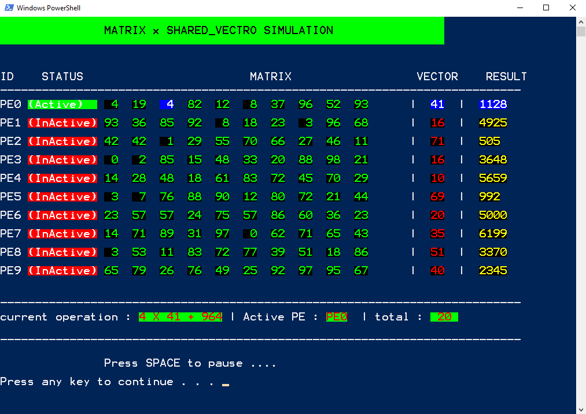

# Matrix Multiplication with Shared Vector Simulation

This C++ project simulates matrix multiplication with a shared vector, showcasing the principles of parallel computing and shared memory utilization.

## Overview

Matrix multiplication is a fundamental operation in linear algebra and computational mathematics. This project demonstrates how matrix multiplication can be parallelized using shared memory techniques, specifically with the utilization of a shared vector for efficient computation.

## Features

- **Parallel Matrix Multiplication**: Utilizes parallel computing techniques to speed up matrix multiplication.
- **Shared Vector Simulation**: Implements a shared vector to efficiently store and access data during computation.
- **Performance Analysis**: Includes performance analysis to evaluate the speedup achieved through parallelization.

